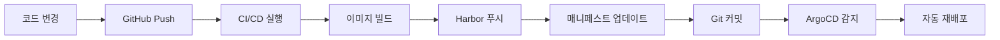

# GitOps 워크플로우 핸즈온 가이드

## 🎯 목표
완전 자동화된 GitOps 워크플로우 구현: 코드 변경부터 배포까지 수동 개입 없이 자동화

---

## 📋 전체 워크플로우 개요



---

## 🛠️ 단계별 실습

### **1단계: 코드 변경 → GitHub Push**

#### **실습 내용**:
```bash
# 코드 수정 (예: README.md 업데이트)
echo "# Updated Spring PetClinic" > README.md

# Git 커밋 & 푸시
git add .
git commit -m "Update application"
git push origin main
```

#### **결과**:
- GitHub Actions 워크플로우 자동 트리거
- `${{ github.sha }}` 값 생성 (예: `abc123def456...`)

---

### **2단계: CI/CD 실행 → 이미지 빌드**

#### **GitHub Actions 워크플로우**:
```yaml
env:
  IMAGE_NAME: spring-petclinic
  REGISTRY: harbor.bluesunnywings.com
  IMAGE_TAG: ${{ github.sha }}  # 커밋 해시로 고유 태그 생성

steps:
- name: Build with Maven
  run: ./mvnw package -DskipTests

- name: Build and push image
  uses: docker/build-push-action@v6
  with:
    context: .
    push: true
    tags: |
      ${{ env.REGISTRY }}/library/${{ env.IMAGE_NAME }}:${{ env.IMAGE_TAG }}
      ${{ env.REGISTRY }}/library/${{ env.IMAGE_NAME }}:latest
```

#### **실행 결과**:
```
✅ Maven 빌드 완료
✅ Docker 이미지 빌드: spring-petclinic:abc123def456
✅ 보안 스캔 (Trivy SCA + 이미지 스캔)
✅ 이미지 서명 (Cosign)
```

---

### **3단계: Harbor 푸시 → 고유 태그로 저장**

#### **Harbor 저장소 결과**:
```
harbor.bluesunnywings.com/library/spring-petclinic:abc123def456  ← 새 이미지
harbor.bluesunnywings.com/library/spring-petclinic:latest        ← 최신 이미지
```

#### **확인 방법**:
```bash
# Harbor UI에서 확인
https://harbor.bluesunnywings.com

# 또는 CLI로 확인
docker pull harbor.bluesunnywings.com/library/spring-petclinic:abc123def456
```

---

### **4단계: K8s 매니페스트 자동 업데이트**

#### **자동 업데이트 스크립트**:
```yaml
- name: Update K8s manifest with new image tag
  run: |
    sed -i "s|harbor.bluesunnywings.com/library/spring-petclinic:.*|harbor.bluesunnywings.com/library/spring-petclinic:${{ github.sha }}|g" k8s/petclinic.yml
```

#### **변경 전후 비교**:

**변경 전** (`k8s/petclinic.yml`):
```yaml
containers:
  - name: workload
    image: harbor.bluesunnywings.com/library/spring-petclinic:def456ghi789
```

**변경 후** (`k8s/petclinic.yml`):
```yaml
containers:
  - name: workload
    image: harbor.bluesunnywings.com/library/spring-petclinic:abc123def456  # ← 새 커밋 해시
```

---

### **5단계: Git 커밋 → 매니페스트 변경사항 푸시**

#### **자동 커밋 스크립트**:
```yaml
- name: Commit and push updated manifest
  env:
    GITHUB_TOKEN: ${{ secrets.GITHUB_TOKEN }}
  run: |
    git config --local user.email "action@github.com"
    git config --local user.name "GitHub Action"
    git add k8s/petclinic.yml
    git commit -m "Update image tag to ${{ github.sha }}" || exit 0
    git push origin HEAD:main
```

#### **Git 히스토리 결과**:
```
* abc123d - Update image tag to abc123def456 (GitHub Action)
* def456g - Update application (Developer)
* ghi789j - Initial commit
```

---

### **6단계: ArgoCD 감지 → 자동 재배포**

#### **ArgoCD Application 설정**:
```yaml
apiVersion: argoproj.io/v1alpha1
kind: Application
metadata:
  name: petclinic
  namespace: argo-cd
spec:
  source:
    repoURL: 'https://github.com/Jiwon-sim/spring-petclinic.git'
    path: k8s  # ← 이 디렉터리 모니터링
  syncPolicy:
    automated:
      prune: true
      selfHeal: true  # ← 자동 동기화 활성화
```

#### **ArgoCD 동작 과정**:
1. **Git 폴링**: 3분마다 리포지토리 변경사항 확인
2. **변경 감지**: `k8s/petclinic.yml` 파일 수정 발견
3. **동기화 시작**: 새 이미지 태그로 배포 시작
4. **파드 재생성**: 기존 파드 삭제 → 새 이미지로 파드 생성
5. **배포 완료**: 새 버전 서비스 시작

---

## 🔍 실시간 모니터링

### **GitHub Actions 로그 확인**:
```bash
# GitHub UI에서 확인
https://github.com/your-repo/actions

# 또는 CLI로 확인
gh run list
gh run view <run-id>
```

### **ArgoCD 상태 확인**:
```bash
# ArgoCD Application 상태
kubectl get application petclinic -n argo-cd

# 배포된 파드 확인
kubectl get pods -n petclinic

# 파드 이미지 태그 확인
kubectl describe pod -n petclinic <pod-name> | grep Image:
```

### **실시간 로그 모니터링**:
```bash
# 파드 로그 실시간 확인
kubectl logs -f -n petclinic deployment/petclinic

# ArgoCD 동기화 로그
kubectl logs -f -n argo-cd deployment/argocd-application-controller
```

---

## ✅ 성공 확인 체크리스트

### **1. CI/CD 파이프라인**:
- [ ] GitHub Actions 워크플로우 성공
- [ ] 새 이미지 Harbor에 푸시 완료
- [ ] K8s 매니페스트 자동 업데이트
- [ ] Git 커밋 자동 생성

### **2. ArgoCD 배포**:
- [ ] ArgoCD Application `Synced` 상태
- [ ] 새 파드 `Running` 상태
- [ ] 올바른 이미지 태그 사용
- [ ] 애플리케이션 정상 접근

### **3. 전체 워크플로우**:
- [ ] 코드 변경부터 배포까지 완전 자동화
- [ ] 수동 개입 없이 진행
- [ ] 각 단계별 로그 확인 가능
- [ ] 롤백 가능한 상태

---

## 🎯 핵심 포인트

### **GitOps 원칙**:
1. **선언적 설정**: 모든 설정이 Git에 저장
2. **버전 관리**: 모든 변경사항 추적 가능
3. **자동 동기화**: 수동 개입 최소화
4. **관찰 가능성**: 전체 과정 모니터링 가능

### **보안 고려사항**:
- **이미지 서명**: Cosign으로 공급망 보안
- **취약점 스캔**: Trivy로 보안 검사
- **권한 관리**: 최소 권한 원칙 적용
- **시크릿 관리**: GitHub Secrets 활용

### **운영 효율성**:
- **빠른 피드백**: 문제 발생 시 즉시 감지
- **쉬운 롤백**: 이전 커밋으로 간단 복구
- **추적 가능성**: 모든 변경사항 기록
- **일관성**: 환경별 동일한 배포 과정

---

## 🚀 완성된 GitOps 워크플로우

**한 번의 코드 푸시로 모든 것이 자동화됩니다!**

```
개발자 코드 변경 
    ↓
GitHub Push (1분)
    ↓  
CI/CD 실행 (5분)
    ↓
Harbor 이미지 저장 (1분)
    ↓
매니페스트 자동 업데이트 (30초)
    ↓
Git 자동 커밋 (30초)
    ↓
ArgoCD 감지 (3분)
    ↓
자동 재배포 완료 (2분)
```

**총 소요 시간: 약 13분** ⚡

**이제 개발자는 코드만 작성하면 됩니다!** 🎉